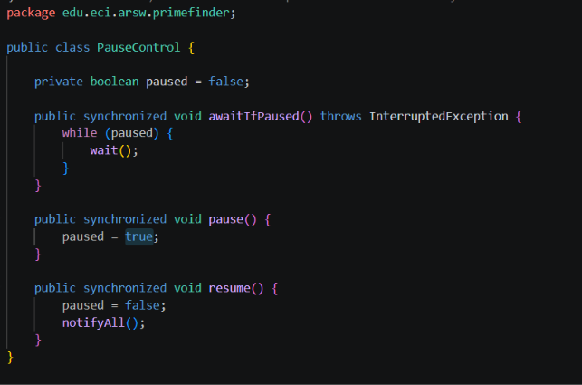
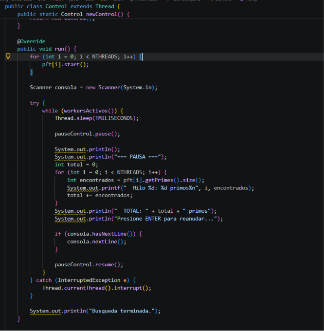

# Sebastian Catillejo y Rafael Moreno
# Snake Race — ARSW Lab #2 (Java 21, Virtual Threads)

**Escuela Colombiana de Ingeniería – Arquitecturas de Software**  
Laboratorio de programación concurrente: condiciones de carrera, sincronización y colecciones seguras.

---

## Requisitos

- **JDK 21** (Temurin recomendado)
- **Maven 3.9+**
- SO: Windows, macOS o Linux

---

## Cómo ejecutar

```bash
mvn clean verify
mvn -q -DskipTests exec:java -Dsnakes=4
```

- `-Dsnakes=N` → inicia el juego con **N** serpientes (por defecto 2).
- **Controles**:
- **Flechas**: serpiente **0** (Jugador 1).
- **WASD**: serpiente **1** (si existe).
- **Espacio** o botón **Action**: Pausar / Reanudar.

---

## Reglas del juego (resumen)

- **N serpientes** corren de forma autónoma (cada una en su propio hilo).
- **Ratones**: al comer uno, la serpiente **crece** y aparece un **nuevo obstáculo**.
- **Obstáculos**: si la cabeza entra en un obstáculo hay **rebote**.
- **Teletransportadores** (flechas rojas): entrar por uno te **saca por su par**.
- **Rayos (Turbo)**: al pisarlos, la serpiente obtiene **velocidad aumentada** temporal.
- Movimiento con **wrap-around** (el tablero “se repite” en los bordes).

---

## Arquitectura (carpetas)

```
co.eci.snake
├─ app/                 # Bootstrap de la aplicación (Main)
├─ core/                # Dominio: Board, Snake, Direction, Position
├─ core/engine/         # GameClock (ticks, Pausa/Reanudar)
├─ concurrency/         # SnakeRunner (lógica por serpiente con virtual threads)
└─ ui/legacy/           # UI estilo legado (Swing) con grilla y botón Action
```

---

# Actividades del laboratorio

## Parte I — (Calentamiento) `wait/notify` en un programa multi-hilo

1. Toma el programa [**PrimeFinder**](https://github.com/ARSW-ECI/wait-notify-excercise).
2. Modifícalo para que **cada _t_ milisegundos**:
   - Se **pausen** todos los hilos trabajadores.
   - Se **muestre** cuántos números primos se han encontrado.
   - El programa **espere ENTER** para **reanudar**.
3. La sincronización debe usar **`synchronized`**, **`wait()`**, **`notify()` / `notifyAll()`** sobre el **mismo monitor** (sin _busy-waiting_).
4. Entrega en el reporte de laboratorio **las observaciones y/o comentarios** explicando tu diseño de sincronización (qué lock, qué condición, cómo evitas _lost wakeups_).

> Objetivo didáctico: practicar suspensión/continuación **sin** espera activa y consolidar el modelo de monitores en Java.


### Diseño de sincronización

Para pausar todos los hilos a la vez se creó la clase `PauseControl`, que actúa
como **monitor compartido**: una única instancia que `Control` crea y entrega por
constructor a los tres `PrimeFinderThread`. Esto es indispensable, porque `wait()`
y `notifyAll()` solo se comunican entre sí si todos los hilos los invocan **sobre
el mismo objeto**. Los trabajadores no se conocen entre ellos; todos hablan con
este intermediario.



**Qué lock se usa:** el monitor intrínseco de la única instancia de `PauseControl`.
Al ser los tres métodos `synchronized` de instancia, el lock es `this`; y como solo
existe un objeto, existe un solo lock.

**Cuál es la condición:** el atributo `private boolean paused`. Es privado y solo se
lee o escribe dentro de métodos `synchronized`, por lo que no necesita ser `volatile`:
`synchronized` ya garantiza exclusión mutua **y** visibilidad entre hilos (relación
*happens-before*).

**Cómo se evitan los lost wakeups:** la verificación de la condición y la llamada a
`wait()` ocurren dentro del mismo bloque sincronizado. Si el flag se leyera fuera del
lock, `Control` podría cambiarlo y notificar justo entre la verificación y el `wait()`,
dejando al hilo dormido tras una señal que ya pasó. Además se usa `while (paused)` y
no `if (paused)`, porque `wait()` puede retornar sin que nadie haya notificado
(*spurious wakeup*) y porque `notifyAll()` despierta a los tres hilos a la vez, de modo
que cada uno debe reevaluar la condición por su cuenta.

**Por qué `notifyAll()` y no `notify()`:** hay tres hilos esperando sobre el mismo
monitor. `notify()` despertaría solo a uno arbitrario y los otros dos quedarían
dormidos indefinidamente.

### Flujo de ejecución

`Control` deja de ser un hilo que muere tras arrancar a los trabajadores y pasa a ser
un supervisor con su propio ciclo:



1. Duerme `TMILISECONDS` (5000 ms).
2. Llama a `pauseControl.pause()`, que **solo levanta la bandera y retorna al instante**.
   La pausa no es inmediata: cada trabajador se detiene por su cuenta cuando llega a su
   siguiente llamada a `awaitIfPaused()`. Es como poner un semáforo en rojo: el cambio es
   instantáneo, pero los carros frenan cuando llegan a él.
3. Con los tres hilos ya dormidos, lee y reporta cuántos primos lleva cada uno.
4. Se bloquea en `Scanner.nextLine()` esperando el ENTER.
5. Llama a `pauseControl.resume()`, que pone `paused = false` **y** ejecuta `notifyAll()`.
   Cambiar el estado no basta: un hilo dormido en `wait()` no se entera solo de que el
   flag cambió.

El ciclo termina cuando `workersActivos()` detecta que los tres hilos ya recorrieron su rango.

### Ausencia de espera activa

No hay *busy-waiting* en ningún punto del programa:

- Los trabajadores pausados están bloqueados en `wait()`, fuera de la cola de ejecución
  del sistema operativo (0% de CPU).
- `Control`, entre pausas, está bloqueado en `Thread.sleep()`.
- `Control`, esperando el ENTER, está bloqueado leyendo `System.in`.

En ningún lado existe un `while (paused) { }` girando en vacío.

### Colección no segura corregida

`PrimeFinderThread.primes` era un `LinkedList` que el hilo trabajador escribe y que
`Control` lee con `.size()` al pausar: una condición de carrera. Se sustituyó por
`Collections.synchronizedList(new LinkedList<>())`.

Adicionalmente se actualizó el `pom.xml` de `1.7` a `maven.compiler.release 21`, ya que
JDK 21 no admite compilar para Java 7.

### Ejecución

El proyecto de la Parte I quedó incluido en este mismo repositorio, en la carpeta
`wait-notify-excercise/`:

```bash
cd wait-notify-excercise
mvn -q compile exec:java
```

Se usa `compile exec:java` y no solo `exec:java`, porque `exec:java` es un *goal*
suelto que no dispara el ciclo de vida de Maven: ejecuta lo que encuentre en
`target/classes` y falla con `ClassNotFoundException` si el proyecto no se ha
compilado antes.

Salida obtenida (se presiona ENTER en cada pausa):

```
=== PAUSA ===
  Hilo 0: 664579 primos
  Hilo 1: 399951 primos
  Hilo 2: 311830 primos
  TOTAL: 1376360 primos
Presione ENTER para reanudar...

=== PAUSA ===
  Hilo 0: 664579 primos
  Hilo 1: 606028 primos
  Hilo 2: 563139 primos
  TOTAL: 1833746 primos
Presione ENTER para reanudar...

=== PAUSA ===
  Hilo 0: 664579 primos
  Hilo 1: 606028 primos
  Hilo 2: 587252 primos
  TOTAL: 1857859 primos
Presione ENTER para reanudar...

Busqueda terminada.
```

El total final es **1.857.859 primos**, que coincide con π(3×10⁷), el número real de
primos menores a 30.000.000; esto confirma que la pausa y la reanudación no alteran ni
pierden resultados.

Nótese que el Hilo 0 se congela en 664.579 = π(10⁷) desde la primera pausa: ya terminó
su rango. Un hilo terminado está muerto, no dormido, así que deja de consultar el
monitor y su contador no vuelve a cambiar. También se observa que cada hilo encuentra
menos primos que el anterior, porque los primos se vuelven más escasos entre números
grandes, no porque un hilo trabaje más lento.

---

## Parte II — SnakeRace concurrente (núcleo del laboratorio)


### 1) Análisis de concurrencia

- Explica **cómo** el código usa hilos para dar autonomía a cada serpiente.
- **Identifica** y documenta en **`el reporte de laboratorio`**:
  - Posibles **condiciones de carrera**.
  - **Colecciones** o estructuras **no seguras** en contexto concurrente.
  - Ocurrencias de **espera activa** (busy-wait) o de sincronización innecesaria.

### 2) Correcciones mínimas y regiones críticas

- **Elimina** esperas activas reemplazándolas por **señales** / **estados** o mecanismos de la librería de concurrencia.
- Protege **solo** las **regiones críticas estrictamente necesarias** (evita bloqueos amplios).
- Justifica en **`el reporte de laboratorio`** cada cambio: cuál era el riesgo y cómo lo resuelves.

### 3) Control de ejecución seguro (UI)

- Implementa la **UI** con **Iniciar / Pausar / Reanudar** (ya existe el botón _Action_ y el reloj `GameClock`).
- Al **Pausar**, muestra de forma **consistente** (sin _tearing_):
  - La **serpiente viva más larga**.
  - La **peor serpiente** (la que **primero murió**).
- Considera que la suspensión **no es instantánea**; coordina para que el estado mostrado no quede “a medias”.

### 4) Robustez bajo carga

- Ejecuta con **N alto** (`-Dsnakes=20` o más) y/o aumenta la velocidad.
- El juego **no debe romperse**: sin `ConcurrentModificationException`, sin lecturas inconsistentes, sin _deadlocks_.
- Si habilitas **teleports** y **turbo**, verifica que las reglas no introduzcan carreras.

> Entregables detallados más abajo.

### Uso de hilos

Cada serpiente vive en su propio `SnakeRunner`, lanzado con
`Executors.newVirtualThreadPerTaskExecutor()`. En el ciclo, el runner decide si
gira, llama `board.step(snake)` y duerme 80 ms (40 ms si tiene turbo). El
`GameClock` no mueve nada: cada 60 ms pide un `repaint()` en el hilo de Swing.
La autonomía sale de ahí. El problema es que los N runners y la UI comparten el
tablero y el cuerpo de cada serpiente.

### Condiciones de carrera

1. **La pausa no pausaba las serpientes.** El botón `Action` solo hacía
   `clock.pause()`. El reloj dejaba de pintar, pero los runners seguían en su
   `while` con `Thread.sleep`. El juego se movía “a ciegas”.
2. **Cuerpo de la serpiente.** El runner hace `advance()` y Swing hace
   `snapshot()` al pintar, sobre el mismo `ArrayDeque`. Sin exclusión mutua se
   ve un cuerpo a medias (*tearing*) o sale `ConcurrentModificationException`.
3. **Tablero.** Varios runners pueden comer el mismo ratón, pisar el mismo
   turbo o meter un obstáculo a la vez. El starter ya tenía `step()` y los
   getters `synchronized` (y los getters devuelven copia). Eso se dejó.
4. **El juego arrancaba solo.** Pedían Iniciar / Pausar / Reanudar, pero el
   constructor ya lanzaba hilos y reloj.

Las reglas piden **rebote** contra el obstáculo; el punto 3 pide la serpiente
que **primero murió**. Se dejó el rebote (`HIT_OBSTACLE` → `randomTurn()`).
Mueren solo si la cabeza cae en su propio cuerpo. Si todavía no ha pasado, al
pausar sale que no ha muerto ninguna.

### Colecciones no seguras

- `Snake.body` era un `ArrayDeque` leído y escrito desde dos hilos. Se protegió
  con métodos `synchronized` sobre la serpiente (`head`, `snapshot`, `advance`,
  `die`). El lock cubre esa cola, no el tablero entero. `direction` se dejó
  `volatile` porque es un solo campo; `turn()` no toca el cuerpo.
- `mice`, `obstacles`, `turbo` y `teleports` son `HashSet` / `HashMap`. No hace
  falta cambiarlos a `ConcurrentHashMap` si todo el acceso ya pasa por
  `step()` / getters sincronizados.
- El `ArrayList` de serpientes en `SnakeApp` se llena en el constructor, antes
  de lanzar hilos, y después solo se lee. No se sincronizó.

### Ausencia de espera activa

No había un `while (paused) { }` girando. Lo más cercano: el `GameClock` seguía
disparando el tick cada 60 ms y lo ignoraba si estaba en `PAUSED`. Eso no come
CPU de verdad (el scheduler duerme), pero las serpientes ni se enteraban.

La pausa real se hizo igual que en la Parte I: un `PauseControl` compartido,
`wait()` / `notifyAll()`, `while (paused)` para no perder despertadas. Los
runners bloqueados están fuera de la cola de ejecución. El reloj, al pausar,
deja de pedir `repaint`.

### Regiones críticas (alcance mínimo)

- **Monitor `PauseControl`:** un solo lock para Iniciar / Pausar / Reanudar.
  Empieza en pausa, para que Iniciar sea Iniciar de verdad. Cada runner llama
  `awaitIfPaused()` al inicio de su vuelta.
- **`Board.step(...)`:** un lock sobre el tablero. Ahí se miran obstáculo,
  ratón, turbo y teleport, y se mutan esos conjuntos. `snake.advance()` se llama
  adentro de ese lock a propósito: comer y crecer quedan atómicos respecto a
  otro `step()`. Orden de locks: siempre board y después snake. El pintado toma
  copias del board (entra y sale del lock) y luego hace `snapshot()` de cada
  snake, así que no se cruzan y no hay deadlock.
- **Cada `Snake`:** solo el `ArrayDeque` del cuerpo. No se envolvió el juego
  entero en un `synchronized`.

Teleports y turbo quedan cubiertos por el mismo `step()`: dos serpientes no
pueden “comerse” el mismo rayo a la vez ni ver el mapa a medio actualizar.

### Pausa / reanudar y estadísticas

La suspensión no es instantánea: pausar no corta el `step()` que ya iba. El
runner termina el movimiento (o el `sleep`) y en la siguiente
`awaitIfPaused()` se duerme. Si se leyeran las stats en el click, alguna
serpiente todavía estaría a mitad de avance.

`PauseControl` cuenta `running` (hilos que siguen vivos) y `parked` (hilos que
ya están en `wait()`). `awaitQuiescent()` espera `parked >= running`. Recién
ahí Swing arma el texto:

- **Viva más larga:** entre las que `isAlive()`, la de mayor `length()`.
- **Peor:** entre las muertas, la de menor `deathMillis()`.

El botón pasa por Iniciar → Pausar → Reanudar. Espacio hace lo mismo. El id de
cada serpiente se pinta en la cabeza para cruzarlo con la barra de abajo.

### Ejecución

```bash
mvn -q -DskipTests exec:java
mvn -q -DskipTests exec:java -Dsnakes=20
```

Con el default (2) se ven mejor las stats. Con 20, sin el `synchronized` del
cuerpo el pintado revienta; con los locks de arriba no debería salir
`ConcurrentModificationException` ni trabarse. Las muertas se pintan grises.

Al pausar, la barra inferior muestra la viva más larga y la peor. Si se pausa
muy pronto puede decir que todavía no muere ninguna; para ver la peor hay que
esperar a que una se pliegue sobre sí misma (el obstáculo naranja solo rebota).

---

## Entregables

1. **Código fuente** funcionando en **Java 21**.
2. Todo de manera clara en **`**el reporte de laboratorio**`** con:
   - Data races encontradas y su solución.
   - Colecciones mal usadas y cómo se protegieron (o sustituyeron).
   - Esperas activas eliminadas y mecanismo utilizado.
   - Regiones críticas definidas y justificación de su **alcance mínimo**.
3. UI con **Iniciar / Pausar / Reanudar** y estadísticas solicitadas al pausar.

---

## Criterios de evaluación (10)

- (3) **Concurrencia correcta**: sin data races; sincronización bien localizada.
- (2) **Pausa/Reanudar**: consistencia visual y de estado.
- (2) **Robustez**: corre **con N alto** y sin excepciones de concurrencia.
- (1.5) **Calidad**: estructura clara, nombres, comentarios; sin _code smells_ obvios.
- (1.5) **Documentación**: **`reporte de laboratorio`** claro, reproducible;

---

## Tips y configuración útil

- **Número de serpientes**: `-Dsnakes=N` al ejecutar.
- **Tamaño del tablero**: cambiar el constructor `new Board(width, height)`.
- **Teleports / Turbo**: editar `Board.java` (métodos de inicialización y reglas en `step(...)`).
- **Velocidad**: ajustar `GameClock` (tick) o el `sleep` del `SnakeRunner` (incluye modo turbo).

---

## Cómo correr pruebas

```bash
mvn clean verify
```

Incluye compilación y ejecución de pruebas JUnit. Si tienes análisis estático, ejecútalo en `verify` o `site` según tu `pom.xml`.

---

## Créditos

Este laboratorio es una adaptación modernizada del ejercicio **SnakeRace** de ARSW. El enunciado de actividades se conserva para mantener los objetivos pedagógicos del curso.

**Base construida por el Ing. Javier Toquica.**
